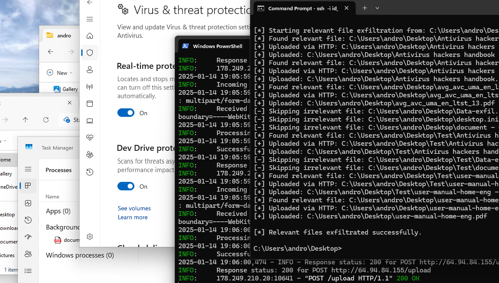

# Malware Stealth Injector

## Project Overview
This program is a stealth malware injector designed to evade analysis, maintain persistence, establish reverse shell connections, automate the exfiltration of relevant files, and then delete itself after a predetermined number of reboots. The code leverages various anti-analysis techniques, persistence mechanisms, and remote command execution capabilities.

### Key Features
- **Stealth Execution**: Runs as a hidden process.
- **Anti-Analysis**: Checks for debuggers, sandboxes, and virtual machines to avoid detection.
- **Persistence**: Ensures the malware is executed during system startup
- **Reverse Shell**: Establishes a reverse shell connection to a specified C2 server.
- **Self Destruct**: Deletes itself after a predetermined number of reboots
- **Data Exfil**: Automates the extraction of sensitive files to a remote server.

## File Structure
```
ProjectDirectory/
│
├── build/
│   └── resource.o
│
├── include/
│   ├── main.h
│   ├── Authenticator.h
│   ├── Utilities.h
│   ├── Paths.h
│   ├── AnalysisEvasion.h
│   ├── ReverseShell.h
│   └── persistence.h
│
├── src/
│   ├── main.cpp
│   ├── Authenticator.cpp
│   ├── Utilities.cpp
│   ├── Paths.cpp
│   ├── AnalysisEvasion.cpp
│   ├── persistence.cpp
│   ├── ReverseShell.cpp
│   ├── self_destruct.cpp
│   ├── exfiltrator.cpp
│   └── gatherer.cpp
```

## Compilation Instructions

Compile the project using the following `g++` command:

```bash
windres resource.rc -O coff -o build/resource.o && \
g++ -o build/secreto.exe \
    src/main.cpp \
    src/ReverseShell.cpp \
    src/persistence.cpp \
    src/AnalysisEvasion.cpp \
    src/Paths.cpp \
    src/Authenticator.cpp \
    src/Utilities.cpp \
    src/self_destruct.cpp \
    src/exfiltrator.cpp \
    src/gatherer.cpp \
    build/resource.o \
    -Iinclude \
    -IC:/mingw64/include \
    -IC:/crypto \
    -IC:/fmt-11.0.2/fmt-11.0.2/include \
    -IC:/Users/alexa/json/include \
    -LC:/mingw64/lib \
    -LC:/OpenSSL-Win64/lib/VC/x64/MD \
    -LC:/curl-8.11.0_1-win64-mingw/lib \
    -lcurl -lssl -lcrypto -lgdi32 -luser32 -lkernel32 -lole32 -loleaut32 -lws2_32 \
    -luuid -lwbemuuid -lwinhttp -lshlwapi -static -std=c++17 -pthread \
    -Wno-deprecated-declarations -mwindows

```

## About This Tool



### Persistence
```Purpose:
To ensure the tool remains active across system reboots, it leverages robust persistence mechanisms by registering itself in critical system areas such as the Windows Registry, startup folders, and scheduled tasks. The persistence.h module, with functions like setupPersistence(), is invoked during the runStealthTasks() initialization process. This module copies the executable to a secure system location and establishes persistence through the creation of registry keys or startup folder shortcuts, guaranteeing uninterrupted operation.
```

### Reverse Shell
```Purpose:
Allow the attacker to remotely access and control the infected machine.

The ReverseShell.h and its corresponding source file implement the functionality to connect back to a Command and Control (C&C) server.
In runStealthTasks(), the code calls RunShell(host, port) using specified C&C IP and port values.
It also handles reconnection through ReconnectToListener(C2Server, C2Port).
```

### Analysis Evasion
```Purpose:
Avoid detection by security products and sandbox environments through various anti-analysis techniques.

The AnalysisEvasion.h module (and the AntiAnalysis class within) provides several methods:
Delay Introduction: A pause before executing further actions (e.g., IntroduceDelay(1000)).
Debugger Detection: Checks if a debugger is attached.
Virtual Machine Detection: Scans for indicators of virtualized environments.
Sandbox Evasion: Attempts to bypass common sandbox restrictions.
Screen Resolution and Process Count Checks: Helps determine if running on a typical end-user system.
```

### Data Gathering and Exfiltration
```Purpose:
Collect sensitive files from the system and exfiltrate them to a remote server.

The gatherer.h/gatherer.cpp and exfiltrator.h/exfiltrator.cpp modules handle file collection and data transmission.
In main(), after a threshold is met (tracked by a reboot counter), the tool begins gathering files from a specified directory (here, "C:\\") and uploads them to the defined target URL.
```
### Self-Destruction
```Purpose:
Erase the malware from the system after completing its tasks or upon reaching a condition (e.g., after exfiltrating data).

The self_destruct.h module contains logic to remove the executable.
It is called in main() after data exfiltration, ensuring that the malware 
attempts to erase itself regardless of whether the exfiltration succeeded.
```

###  Stealth Process Management
```Purpose:
Ensure that only one instance of the stealth process is running and that it operates without alerting the user.

The tool checks for an existing instance of its stealth process using a global mutex (Global\\StealthProcessMutex) to prevent multiple instances.
If the tool is invoked with the "stealth" argument, it runs runStealthTasks() in a separate thread and then enters an infinite sleep to remain active without a visible window.
The function launchStealthProcess() creates a new process with the CREATE_NO_WINDOW and DETACHED_PROCESS flags to run in the background.
```
## Notes
This program is intended for **educational purposes only**. Use it responsibly and ensure you have permission before testing it on any system.
